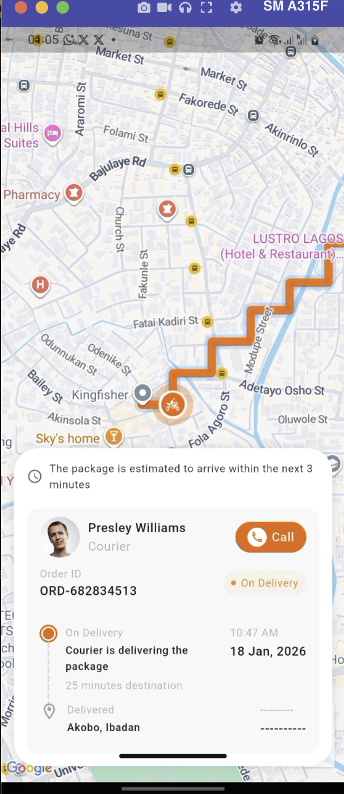

# Shipa Tracking 🛵

A real-time rider tracking app built with Flutter, featuring location updates, smooth marker animation, and ETA calculation.

## 📲 Download

[](https://github.com/deecodez/shipa_assessment/releases/download/v1.0.0/app-release.apk)

[](https://drive.google.com/drive/folders/1acmZJPPg2Up8nGFLq2gmqvYUk-5i8SnK?usp=sharing)

> Requires Android 6.0 (API 23) or higher

## ✨ Features

- Rider location tracking via stream
- Smooth marker animation along the polyline route
- Real-time ETA countdown in minutes
- Staircase polyline with sharp mitered joints
- Custom rider and destination markers
- Auto camera tracking that follows the rider

## 🛠 Tech Stack

- **Flutter** — UI framework
- **Riverpod** — state management
- **Google Maps Flutter** — map rendering
- **StreamProvider** — real-time location stream

## 🏗 Architecture

- MVVM

## 🚀 Run Locally

1. Clone the repo

```bash
   git clone https://github.com/deecodez/shipa_assessment.git
   cd YOUR_REPO
```

2. Install dependencies

```bash
   flutter pub get
```

3. Run the app

```bash
   flutter run
```

## 📸 Screenshots


| Map View                     
| ----------------------------- 
| 
